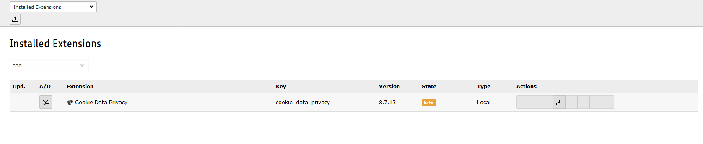
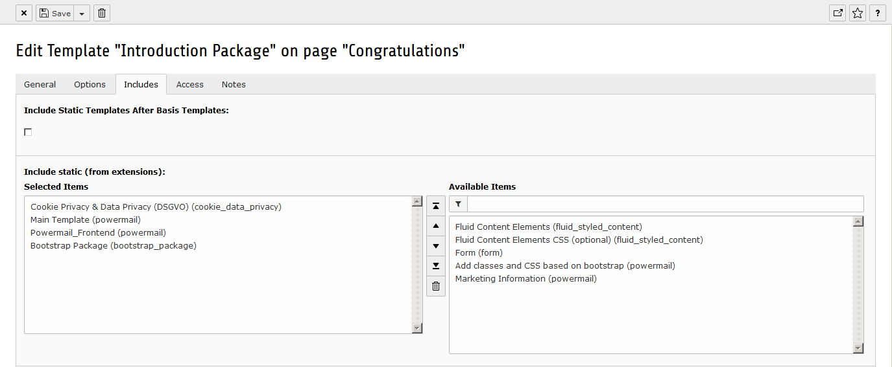
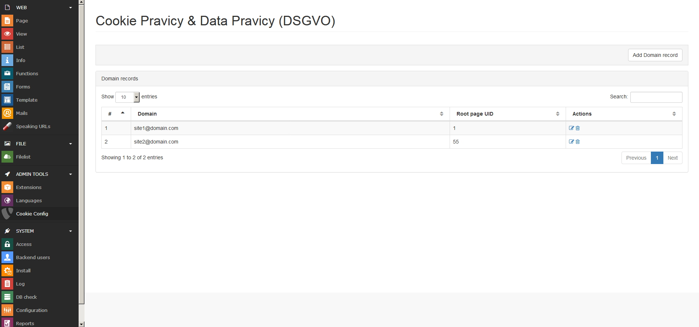
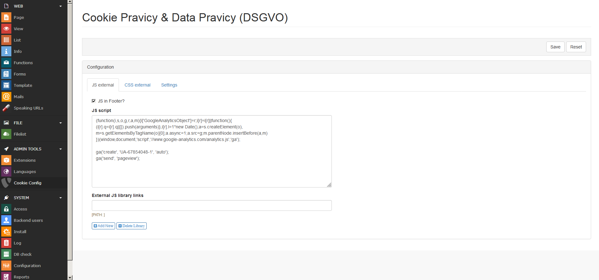

.. ==================================================
.. FOR YOUR INFORMATION
.. --------------------------------------------------
.. -*- coding: utf-8 -*- with BOM.

.. include:: ../Includes.txt

.. _admin-manual:

Administrator Manual
====================

.. _admin-installation:

Installation
------------

To install the extension, perform the following steps:

#. Download vhs dependency extension from TYPO3 Extension Repository and install the extension from extension manager.
#. Download cookie_data_privacy extension from TYPO3 Extension Repository.
#. Install the extension from extension manager.

Static Templates
""""""""""""""""

Add cookie_data_privacy static template

.. _admin-configuration:

Backend Configuration
---------------------

Add your domain and root page ID to support multi-domain.

Configuration for external JS libraries, Google Analytics script, ga('send') click count scripts, external CSS libraries like bootstrap, google fonts, settings about cookie bar

.. important::

   Donot forget to Clear frontend caches and Clear all system-related caches (Flush all caches)