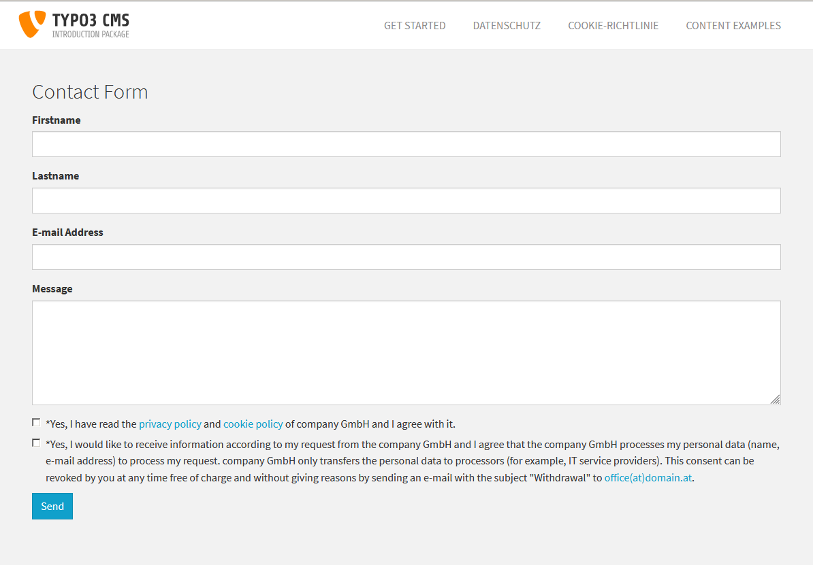

.. ==================================================
.. FOR YOUR INFORMATION
.. --------------------------------------------------
.. -*- coding: utf-8 -*- with BOM.

.. include:: ../Includes.txt

.. _introduction:

Introduction
============

.. _what-it-does:

What does it do?
----------------

As per Cookie Privacy law website must need permission from user that we're storing data on their computer and for Data Privacy law website must need permission from user that we're stroing personal data/form data/newsletter/registration data to our database. It's hard to handle if we used many external data/links when user deny cookie, so for website should No external links, No external JS libraries, No external CSS libraries, No external images links. Forms should have two mandatory checkbox that user know before submitting personal data. Website must not tracking after user deny. Website must serve data to the user from single server. I have tried to cover all conditions of DSGVO.

- Cookie Privacy: The Cookie Law is a piece of privacy legislation that requires websites to get consent from visitors to store or retrieve any information on a computer, smartphone or tablet.
- Data Privacy: Datenschutz-Grundverordnung (DSGVO), englisch General Data Protection Regulation (GDPR) is a regulation of the European Union , which standardises the rules on the processing of personal data by private companies and public authorities across the EU. DSGVO is directly applicable from 25 May 2018.

.. _screenshots:

Screenshots
-----------

**Cookie Privacy**

   
**Data Privacy**

   